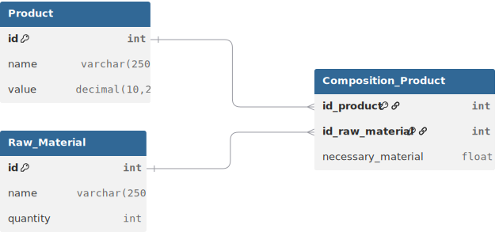

# Pratical test - Autoflex

## Introduction

This project aims to provide a web-based solution for controlling raw materials stock and managing product production. The system allows the registration of products and raw materials, their association, and the calculation of which products can be manufactured based on available stock, prioritizing higher-value products. The application follows an API-based architecture, separating back-end and front-end responsibilities to ensure scalability and maintainability.

## Phase 1 – Requirement Analysis

Detailed analysis of system requirements for product management and raw material composition.

- **Functional Requirements:** Identification of the core CRUD operations for products and raw material inventory management.
- **Business Rules:** Definition of product composition logic (a product is composed of multiple raw materials with specific required quantities).
- **Use Cases:** Mapping primary interactions: creating products, checking material stock, and defining production formulas.

## Phase 2 – Database Modeling

Relational modeling focused on integrity and scalability within **Oracle Autonomous Database**.

- **Relational Schema:** Design of Product, RawMaterial, and the associative entity CompositionProduct.
- **Complex Relationships:** Implementation of a **Many-to-Many relationship with extra attributes** (required quantity), utilizing composite primary keys (EmbeddedId).
- **Data Integrity:** Definition of Constraints, Foreign Keys, and decimal precision (BigDecimal) for monetary values to ensure compliance with financial standards.

## Phase 3 – API Modeling

RESTful interface design based on industry best practices.

- **Resource Modeling:** Definition of endpoints for the Product resource (GET, POST, PUT, PATCH, DELETE).
- **Data Contracts (DTOs):** Creation of immutable **Data Transfer Objects** (Java Records) to protect the persistence layer and define clear Request/Response structures.
- **Data Flow Design:** Architectural design of the request lifecycle: *Client -> Resource -> Service -> Repository -> Oracle DB*.

## Phase 4 – Back-end Development

Technical implementation using the modern Java ecosystem and high-quality design patterns.

- **Tech Stack:** Project configuration with **Quarkus 3.x** and **Jakarta EE 10**.
- **Advanced Persistence:** Integration with **Hibernate ORM with Panache**, adopting the **Repository Pattern** to decouple the database from business logic.
- **SOLID Principles:**
    - **Single Responsibility:** Clear separation between Resources, Services, and Repositories.
    - **Dependency Inversion:** Extensive use of Contexts and Dependency Injection (CDI) and service interfaces.
- **Object Mapping:** Implementation of **MapStruct** for automatic, high-performance conversion between Entities and DTOs, eliminating repetitive manual code.

## Phase 5 – Front-end Development

Creation of the user interface to consume the API.

- **Tech Setup:** Initial setup planned with **Next.js** and Tailwind CSS.
- **API Integration:** Consumption of Swagger-documented endpoints using robust fetch libraries (Axios/SWR).
- **UI/UX:** Modeling screens for product listings and dynamic composition forms.

## Phase 6 – Tests and Validation

Quality assurance and code stability.

- **Integration Testing:** Validation of entity lifecycles during development via **Quarkus Dev Mode**.
- **Data Validation:** Implementation of **Jakarta Bean Validation** (@Valid, @NotBlank, @Positive) to ensure data consistency before it reaches the database.
- **Maven Lifecycle:** Use of Maven Surefire for build automation and dependency validation.

## Phase 7 – Deployment & Infrastructure

Strategy for publication and container orchestration.

- **Dockerization:** Creation of optimized multi-layer Docker images for JVM, published to **Docker Hub**.
- **Local Hosting (TrueNAS):** Automated deployment on a local **TrueNAS Scale** server via the native Kubernetes (k3s) orchestrator.
- **Cloud Connectivity:** Secure **Oracle Wallet** injection via persistent volumes, establishing an mTLS connection with the cloud database.
- **Global Exposure:** Custom domain configuration via **Cloudflare Tunnel**, protecting the local network while providing automatic HTTPS.
- **Observability:** **Swagger UI** enabled in production and structured logging for real-time API health monitoring.

## Database Modeling

## API Modeling

The API modeling was defined to fully meet the functional requirements specified for the system. Each requirement is directly mapped to one or more API endpoints, ensuring clear traceability between business needs and technical implementation.

**RF001 – Product Management (CRUD)**

The product resource is exposed through a complete set of CRUD endpoints, allowing the creation, retrieval, update, and deletion of products.

Endpoints: `POST /products`, `GET /products`, `GET /products/{id}`, `PUT /products/{id}`, `DELETE /products/{id}`.

**RF002 – Raw Material Management (CRUD)**

Raw materials are managed through dedicated CRUD endpoints, enabling full control over raw material registration and stock information.

Endpoints: `POST /raw-materials`, `GET /raw-materials`, `PUT /raw-materials/{id}`, `DELETE /raw-materials/{id}`.

**RF003 – Product and Raw Material Association**

The association between products and raw materials is handled through specific endpoints that allow defining, updating, and removing the composition of each product, including the required quantity of each raw material.

Endpoints: `POST /products/{id}/raw-materials`, `PUT /products/{id}/raw-materials/{rawMaterialId}`, `DELETE /products/{id}/raw-materials/{rawMaterialId}`.

**RF004 – Production Feasibility and Suggestion**

A dedicated endpoint is responsible for calculating which products can be manufactured based on the available raw material stock. This endpoint applies the business rule of prioritizing higher-value products and returns the producible quantity and total production value.

Endpoint: `GET /production/suggestion`.

- RF004 Logic
  1. Create an in-memory snapshot representing all raw material stock stored in the database.
  2. Retrieve the list of products ordered from highest to lowest value.
  3. For each product:
     3.1 Determine the maximum quantity that can be produced based on the remaining in-memory stock.
     3.2 If at least one unit can be produced:
     3.3 Add the product and its producible quantity to the suggestion list.
     3.4 Deduct the consumed raw materials from the in-memory stock to ensure subsequent products do not reuse already allocated resources.
  4. Return the final list of producible products, maximizing the total stock value.

Through this mapping, the API design ensures full compliance with the defined functional requirements while keeping business rules centralized and the system architecture well-structured.

## API Documentation - Swagger

[OpenAPI UI (Powered by Quarkus 3.31.2)](https://autoflexapi.thalesleal.icu/q/swagger-ui/)

## Website - Frontend

[Autoflex - Production Management](https://autoflex.thalesleal.icu/)

## Tests

Automated tests were implemented using **Cypress**, covering both back-end API behavior and front-end user flows, as suggested in the challenge.

### Back-end (API)
- API and integration tests executed using **Cypress**
- Validation of:
  - Product, Raw Material and Composition CRUD endpoints
  - Business rule RF004 (production feasibility and prioritization)
  - Request/response contracts and HTTP status codes

### Front-end
- End-to-end tests implemented using **Cypress**
- Coverage includes:
  - Product CRUD flows
  - Raw material CRUD flows
  - Product ↔ Raw material association
  - Production suggestion listing based on available stock

## Requirements Compliance

The solution fully complies with all functional and non-functional requirements defined in the challenge:

### Non-Functional Requirements
- [x] Web-based system compatible with modern browsers
- [x] API-based architecture separating back-end and front-end
- [x] Responsive front-end interface
- [x] Database persistence using Oracle
- [x] Back-end developed with Quarkus
- [x] Front-end developed with a modern JavaScript framework

### Functional Requirements
- [x] RF001 – Product management (CRUD)
- [x] RF002 – Raw material management (CRUD)
- [x] RF003 – Product and raw material association
- [x] RF004 – Production feasibility and suggestion logic
- [x] RF005 – Product management interface (Front-end)
- [x] RF006 – Raw material management interface (Front-end)
- [x] RF007 – Product composition management interface
- [x] RF008 – Production suggestion visualization

## Highlights

- Full compliance with all functional and non-functional requirements
- Business rule RF004 implemented with priority-based production simulation
- Clear separation of concerns using Resource, Service, and Repository layers
- Use of DTOs and MapStruct for safe and efficient data mapping
- Automated API and end-to-end tests using Cypress
- Production-ready API documentation via Swagger UI

## Executive Summary

This project was developed as a practical test for Autoflex, aiming to demonstrate the implementation of a complete web-based solution for raw material stock control and production planning.

Although my main professional experience is focused on **Node.js, TypeScript, and NestJS**, this project was intentionally developed using **Quarkus and the Java ecosystem**, both to align with Autoflex's technology stack and to demonstrate adaptability to different environments and technologies.

Before implementation, a detailed technical documentation and architectural planning phase was conducted. This approach streamlined the development process and ensured consistency across database modeling, API design, and business rules implementation.

